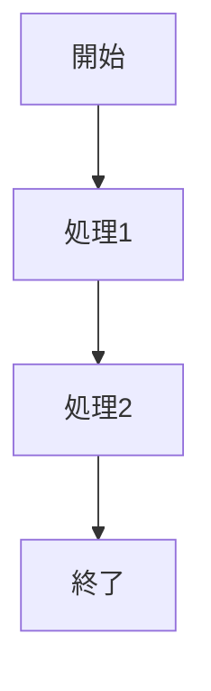

# Marp プレゼンテーション開発環境

Markdown を使用して美しいプレゼンテーションスライドを作成するための環境です。[Marp](https://marp.app/)（Markdown Presentation Ecosystem）を活用して、簡単にスライドを作成・エクスポートできます。

## 📋 特徴

- Markdownの簡潔な構文でスライド作成
- HTML、PDF、PowerPointなど複数の形式へのエクスポート
- カスタムテーマによるスライドのスタイリング
- コード構文ハイライト対応
- 数式表示（MathJax）対応
- 図表作成（Mermaid）対応

## 🚀 はじめ方

### 前提条件

- [Node.js](https://nodejs.org/) (バージョン12以上推奨)
- npm (Node.jsと共にインストールされます)

### インストール

```bash
# 依存パッケージのインストール
npm install
```

## 💻 使用方法

### 開発サーバーの起動

```bash
npm start
```

ブラウザで [http://localhost:8080](http://localhost:8080) を開くと、スライドのプレビューが表示されます。ファイルを編集すると自動的に更新されます。

### ウォッチモード

```bash
npm run watch
```

ファイルの変更を監視し、変更があるとプレビューを更新します。

### ビルド

```bash
# 全形式（HTML, PDF, PPTX）へのエクスポート
npm run build

# HTMLのみエクスポート
npm run build:html

# PDFのみエクスポート
npm run build:pdf

# PowerPointのみエクスポート
npm run build:pptx
```

## 📝 スライド作成方法

1. `slides` ディレクトリにマークダウンファイルを作成します
2. ファイルの先頭に以下の設定を追加します:

```markdown
---
marp: true
theme: custom-theme  # カスタムテーマを使用する場合
paginate: true       # ページ番号を表示する場合
---
```

3. スライドは `---` で区切ります:

```markdown
# 最初のスライド

内容...

---

# 2枚目のスライド

内容...
```

### 基本的な書式

```markdown
# 見出し1 (スライドタイトルに適しています)
## 見出し2 (サブタイトル)

- 箇条書き1
- 箇条書き2

1. 番号付きリスト1
2. 番号付きリスト2

**太字** と *斜体*

[リンクテキスト](https://example.com)


 # 幅指定
```

### コードブロック

````markdown
```javascript
function hello() {
  console.log("Hello, Marp!");
}
```
````

### Mermaid図表

````markdown

````

### 数式

```markdown
$E=mc^2$

$$
\frac{d}{dx}e^x = e^x
$$
```

## 🎨 カスタムテーマ

プロジェクトには `themes/custom-theme.css` というカスタムテーマが含まれています。使用するには、マークダウンファイルのフロントマターに `theme: custom-theme` を追加します。

独自のテーマを作成するには、`themes` ディレクトリに新しいCSSファイルを作成し、以下のように始めます:

```css
/* @theme your-theme-name */
@import 'default';

/* カスタムスタイル */
section {
  background: #f5f5f5;
}

/* 他のスタイル */
```

## 📁 プロジェクト構成

```
.
├── marp.config.js     # Marpの設定ファイル
├── package.json       # プロジェクト依存関係と設定
├── slides/            # プレゼンテーションのマークダウンファイル
│   ├── sample-presentation.md
│   └── ...
└── themes/            # カスタムテーマCSS
    ├── custom-theme.css
    └── ...
```

## 🔍 詳細情報

- [Marp公式ドキュメント](https://marpit.marp.app/)
- [Marp CLI](https://github.com/marp-team/marp-cli)
- [Marpit Framework](https://github.com/marp-team/marpit)

## 📜 ライセンス

MITライセンス
